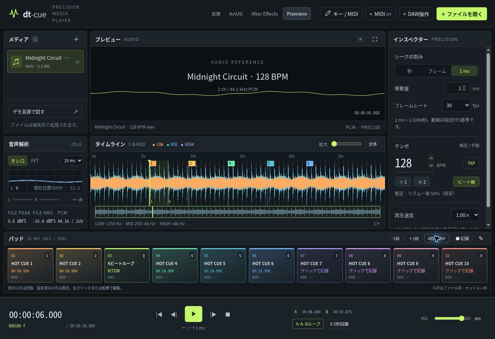
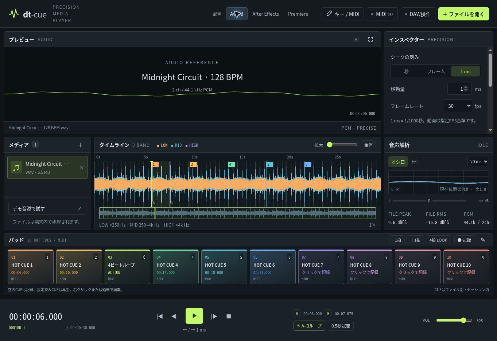
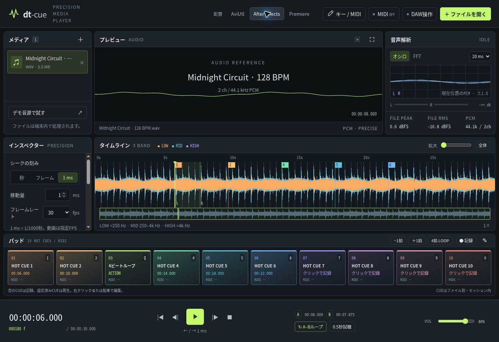
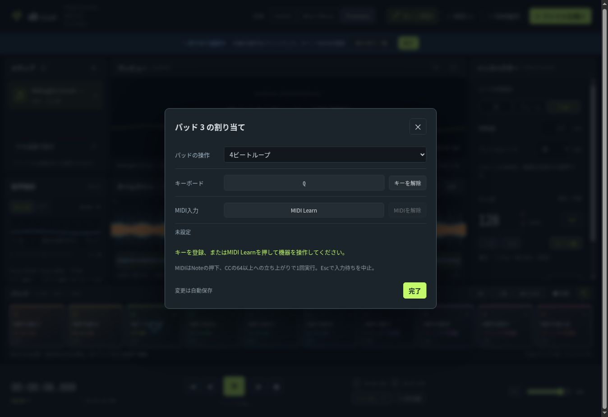

# dt-cue

動画と音楽を、秒・フレーム・1ms刻みで確認するリファレンスプレイヤー。GitHub Pagesにそのまま公開できる静的Webアプリです。

*dt*（時間の微分・微小な時間）と、DJの **CUE** を組み合わせた名前です。

[リリースとダウンロード](https://github.com/Xenoah/dt-cue_precision-media-player/releases) · [プレイヤーを開く](https://xenoah.github.io/dt-cue_precision-media-player/)



<details><summary>AviUtl / After Effects 配置</summary>





</details>

## 機能

- 動画・音声ファイルの選択、複数ファイルの一覧、ドラッグ＆ドロップ
- 秒／フレーム／1msの移動、移動量指定、時刻の直接入力
- 23.976〜120fpsのフレーム送り。フレーム操作では一時停止
- A–Bループ、0.5秒の部分試聴、再生速度、音量、ミュート
- AviUtl／After Effects／Premiereを参考にした3種類の配置
- 鉛筆マークから操作を選んでキー／MIDIを割り当て。重複検出・割り当ての移動・設定保存
- 10個のパフォーマンスパッド：HOT CUE、再生、シーク、ループなどへ自由に変更
- MIDI入力（Note / CC）、MIDI Learn、入力機器の選択・抜き差し検出
- 1／2／4／8ビートループ、1ビート移動、速度±1%、音量／速度のMIDI CC操作
- LOW／MID／HIGHの3バンド波形、全体波形、ズーム、スクラブ
- BPM推定、手入力、タップテンポ、倍／半分の補正、参考ビート線
- ステレオのオシロスコープ、FFT、ライブピーク、ファイル全体のRMS／サンプルピーク
- 動画の全画面・Picture-in-Picture（ブラウザ対応時）
- DAW操作中のグローバルキー用Chrome／Edge拡張を同梱

ファイルはブラウザ内だけで処理します。アップロード、解析サーバー、ログイン、外部CDNは使いません。ページの配信を除き、アプリと拡張はネットワーク通信を行いません。読み込んだファイル自体は保存されず、再読み込みすると再選択が必要です。キー・MIDI割り当て・パッドの操作・選択したMIDI入力・配置・FPS・移動量・音量をlocalStorageに保存します。HOT CUE位置はファイルごとにメモリ内へ保持し、再読み込みで消去します。

## すぐ試す

### Windows

1. ZIPを展開。
2. `Start-Windows.cmd` を実行（Node.jsまたはPython 3が必要）。
3. `http://localhost:4173/` を開き、「デモ音源で試す」か「ファイルを開く」。

起動直後に接続エラーが出た場合は、コマンド画面の起動完了後にページを再読み込みしてください。

### その他の環境

Node.js 22以上で、プロジェクトのルートから実行：

```sh
npm start
```

依存パッケージはありません。`npm install` は不要です。Pythonの場合は `python3 -m http.server 4173 --directory site --bind 127.0.0.1` でも利用できます。

`file://` でHTMLを直接開く方法は、ES ModulesとWorkerの制約があるため対応しません。HTTP(S)で利用してください。

## GitHub Pagesに公開

アプリ本体は `site/` にあります。アプリはビルド不要で、リポジトリのサブパスにも対応します。公開URLは [GitHub Pages](https://xenoah.github.io/dt-cue_precision-media-player/) です。

**Settings → Pages → Build and deployment → Source** では、どちらの公開方式も使えます。

- **GitHub Actions**：mainへのpushでテスト後、`site/` の内容をサイト直下へ公開します。
- **Deploy from a branch → main → / (root)**：GitHubの標準デプロイで公開し、ルートの `index.html` から `site/` へ移動してプレイヤーを開きます。カスタムワークフローはテストだけを実行し、二重デプロイを避けます。

未有効化時はデプロイをスキップし、Actionsの実行概要へ設定手順を表示します。GitHub Actions方式へ切り替えた場合は、`Deploy dt-cue to GitHub Pages` を手動実行するかmainへpushしてください。

ソースを取得する場合：

```sh
git clone https://github.com/Xenoah/dt-cue_precision-media-player.git
cd dt-cue_precision-media-player
npm start
```

## リリース

`package.json` のバージョンを更新してmainへpushすると、テストとパッケージ検証の後、そのバージョンのタグ・GitHub Release・配布ZIPを作成します。同じバージョンの公開済みリリースは上書きしません。リリースノートは `docs/releases/v<version>.md` に用意します。

最新版は **v0.2.0**。本体ZIP、Chrome／Edge補助拡張ZIP、画面スクリーンショット、SHA-256チェックサムを配布します。v0.1.0の初回リリースも保持しています。

## DJパッドとキー／MIDIマッピング

10パッドの初期割り当ては **HOT CUE 1〜10**、キーボードは **1〜9、0** です。過去のキー設定と競合する場合は既存の割り当てを優先します。

- 空のHOT CUEパッドを押すと現在位置を記録。もう一度押すと、その位置へ移動して再生します。CUE再生時は既存のA–Bループを解除します。
- 「● 記録」をオンにしてHOT CUEパッドを押すと、現在位置で上書き。記録後はオフになります。
- パッドを右クリック、または鉛筆を押してからクリックすると編集画面を開きます。「このCUEを削除」で位置を消去できます。
- CUE位置はファイルごとに保持し、一覧で別ファイルへ切り替えて戻っても残ります。**ページの再読み込みでは消去**します。
- パッドの操作は編集画面のプルダウンで変更。HOT CUEのほか、再生／停止、秒・フレーム・ms移動、試聴、ループ、音量、ビート移動、テンポ、波形、配置などを選べます。
- 1／2／4／8ビートループは現在位置を起点としてBPMから区間長を計算します。ビート位置への自動吸着・量子化は行いません。

### 鉛筆マークでキーを変更

1. 上部の **鉛筆「キー / MIDI」** を押す。
2. 点線で囲まれた操作やパッドをクリック。
3. **キーを登録** を押して、好きなキー／修飾キーの組み合わせを入力。
4. 編集画面を閉じ、上部の「完了」で演奏モードへ戻る。

画面に専用ボタンがない操作も「割り当て一覧」で検索できます。重複があれば表示し、「移動して割り当て」で既存の操作から移せます。Escで入力待ちを中止。編集モード中はキーとMIDIによる演奏を停止します。音量／速度の連続値操作はMIDI CC専用で、キーは「音量＋／−」「速度±1%」へ割り当てます。OSやブラウザが予約する組み合わせは受け取れない場合があります。



### MIDIコントローラー

1. Web MIDI対応ブラウザで **HTTPSの公開版**、またはlocalhostを開く。
2. 上部の「MIDI」→「MIDIを有効にする」でアクセスを許可。
3. 鉛筆 → 操作／パッドをクリック → **MIDI Learn** → 機器のパッドやノブを操作。
4. 編集を終了して使用。

- Note On（velocity > 0）とCCを受信します。Note Off／velocity 0では操作しません。CCをボタン操作へ割り当てた場合は、値が64以上になった立ち上がりで1回実行します。
- 音量スライダーと速度欄には絶対値CCを学習できます。音量は0〜100%、速度は50〜150%へ変換。相対エンコーダー方式は未対応です。
- 機器ID・チャンネル・Note/CC番号を区別して保存。MIDI設定で入力を限定でき、切断・再接続も検出します。機器IDが変わった場合は学習し直してください。
- 接続時だけアクセスを要求し、SysExは要求せず、MIDI出力も行いません。MIDIファイルの演奏、MIDIクロック同期、コントローラーのLED出力は含みません。
- MIDIが非対応・不許可でもキーボードと画面操作を使えます。バックグラウンド入力はブラウザ・OS・機器に依存し、スリープしたタブは対象外です。
- DAWが機器を排他利用している場合は共有・仮想ポート等の設定が必要です。**実MIDI機器と実DAWでの配送・遅延は未検証**です。

## DAWを操作しながら再生・シーク

普通のWebページは、他アプリにフォーカスがあると任意のキーボード入力を受け取れません。そこで、拡張のCommands APIから選択したタブへ操作を送ります。

1. Chromeで `chrome://extensions`（Edgeは `edge://extensions`）を開く。
2. 「デベロッパーモード」を有効にし、「パッケージ化されていない拡張機能を読み込む」から配布物内の **extension** フォルダーを選択。
3. dt-cueのタブを開き、拡張アイコンをクリック。拡張に **ON**、アプリの「DAW操作」に緑の点が表示されれば接続済み。
4. 拡張を右クリックして「オプション」→「グローバルキー設定を開く」。各操作の適用範囲を **グローバル** にする。Edgeでは `edge://extensions/shortcuts` からも設定できます。
5. Web画面で一度再生し、DAWに切り替える。

| 初期グローバルキー | 操作 |
| --- | --- |
| Ctrl + Shift + 7 | 再生／一時停止 |
| Ctrl + Shift + 8 | 選択単位で戻る |
| Ctrl + Shift + 9 | 選択単位で進む |
| Ctrl + Shift + 0 | 停止して先頭へ |

その他の操作とパッド1〜10も拡張のショートカット設定で割り当て可能です。パッドはWeb側で選んだ操作を実行します。v0.1.0から更新する場合、拡張もv0.2.0へ更新し、対象タブへ再接続してください。Web画面内のキー設定とは別の設定です。Chromeの仕様により、既定で提案できるキーは4つまで。OS予約キー・他拡張・DAWと競合する場合は別の組み合わせに変更します。キーの取りこぼしを避けるため、非アクティブ時の連打ではデコード完了を待ってください。

- Chrome／Edgeを起動し、対象タブを開いたまま使用します。タブの破棄・スリープ・ブラウザ終了時は利用できません。
- タブの再読み込み・移動後は拡張アイコンを押して再接続します。
- 複数タブがある場合、最後に明示接続したタブだけを操作します。フォーカスは移動しません。
- 拡張は `activeTab`、`scripting`、`storage` のみ要求します。常時のサイトアクセス権限やファイル内容の読み取りは要求しません。
- ChromeOSはグローバルコマンド非対応。Windows／macOS／LinuxでもOSやデスクトップ環境に依存します。
- Media Session対応環境ではメディアキーも利用可能ですが、OSや他の再生アプリによる競合があります。確実なターゲット指定には拡張を使います。
- DAWがオーディオデバイスを排他使用していると、ブラウザ音声を同時再生できないことがあります。DAW／ドライバーの共有設定に依存します。

## 操作の初期割り当て

| キー | 操作 |
| --- | --- |
| Space | 再生／一時停止 |
| K / Home | 停止して先頭へ／先頭へ |
| ← / → | 選択した単位と移動量でシーク |
| Shift + ← / → | 1秒ずつシーク |
| , / . | 1フレームずつ送り・戻し |
| Alt + ← / → | 1msずつシーク |
| I / O / L | A点／B点／ループ切替 |
| Enter | 現在位置から0.5秒試聴（ループを解除） |
| M / ↑ / ↓ | ミュート／音量＋／音量− |

時刻欄は `12.345`、`01:23.456`、`01:02:03.456` を受け付けます。入力欄・選択欄の編集中はプレイヤー用キーを発動しません。

波形をクリック／ドラッグしてシーク。ズーム後は全体波形のクリック／ドラッグで表示区間を移動できます。波形上のホイールは横移動、Ctrl＋ホイールはズームです。

## 精度と解析の意味

### 「1kHz単位」について

要求の「1kHz単位」は **1/1000秒＝1ms刻みの位置指定** と解釈しています。周波数単位でのシークではありません。

- **音声**：デコード成功時はWeb AudioのPCMバッファで再生。要求時刻を保持し、AudioBufferSourceNodeへ秒単位のオフセットを渡します。音声の実際の分解能はPCMサンプルレートに依存します。44.1kHzでも1ms操作の累積丸めを避けています。表示の小数桁は出力デバイスの実測精度を保証しません。
- **動画**：HTMLMediaElementのcurrentTimeを使います。フレーム移動はユーザー指定FPSから計算する時刻送りです。元ファイルのFPSを自動解析する機能はありません。可変FPS、編集リスト、特殊なタイムスタンプ、ブラウザ実装では厳密な前後1コマを保証できません。秒／ms指定でも表示画像は動画に存在するフレームまでです。
- **ループ**：PCM音声は音声レンダリング時計上のループ。動画はcurrentTimeを戻す方式なので、遅延・隙間が生じます。バックグラウンドのタイマー制限は特に動画の短区間ループへ影響します。
- **速度**：PCMでは速度に応じて音程も変化します。高品質なタイムストレッチは未実装です。

### 解析表示

- **3バンド波形**：250Hz／4kHzの一次相補フィルターによる帯域別RMS。全帯域ピークを外形として色の割合を描画します。DJソフトの見え方を参考にした独自実装で、特定製品と同一のアルゴリズムではありません。クロスオーバーは緩やかで帯域は重なります。
- **BPM**：オンセット包絡と発音間隔から推定。リズムが弱い信号は未推定とし、推定値には倍／半分の曖昧さがあります。信頼度に見えるパーセントは推定ビートへの一致割合で、統計的な正答確率ではありません。可変テンポの追従・拍子推定・曲全体に渡る厳密なビートグリッドはありません。
- **ビート線**：推定BPMと検出した発音から作る参考線です。先頭無音やスウィングでずれる場合があります。
- **オシロ**：再生中は音量調整後のL/R出力。停止中は現在位置からのPCM断片を表示。再生中は簡易の立ち上がりトリガーを使います。
- **FFT**：再生中の音量調整後信号。20Hz〜20kHzを対数軸で表示。
- **FILE PEAK / FILE RMS**：デコード後PCMの全体サンプルピーク／RMS（dBFS）。LUFS・True Peakではありません。リサンプリングでサンプル値が0dBFSを超えることがあります。
- **PCM欄**：ブラウザがデコード／リサンプリングしたPCMのレートとチャンネル数。ファイルの元のレートと異なる場合があります。出力・ライブオシロはWeb Audioのステレオミックスです。

全体解析は160MiB超のファイル、推定PCM 220MiB超、またはデコード後PCM 240MiB超で省略します。再生とライブ解析は、ブラウザが再生できる場合に継続利用できます。長尺動画・多数チャンネル・モバイルではメモリに制約があり、任意サイズを保証しません。解析はWorkerへ分離していますが、デコードとデータの複製にはメモリが必要です。

MP4／WebM／WAV／MP3など、実際に使える形式はブラウザのコーデックに従います。ファイルを選択できることは再生・全体解析の対応を意味しません。AVIなどの変換機能はありません。

## 検証

v0.2.0は自動テスト22件。MIDIは模擬入力で受信経路・学習・機器切断・権限拒否を検証しています。

```sh
npm test
```

DSP・シーク境界・非同期再生・PCMループ・試聴スケジューリング・拡張のタブ選択と命令検証をテストします。ブラウザ検証の範囲は [docs/VALIDATION.md](docs/VALIDATION.md) を参照。

**Windows上の実DAW＋OSグローバルキー、Edge／Safari／Firefox、実音声出力の聴感・ループ境界は未検証です。**

## 構成

```text
site/              GitHub Pagesに配信するアプリ
  src/engine.js    PCM / メディア再生エンジン
  src/analysis-*   音声解析とWorker
  src/views.js     波形・スコープ描画
  src/app.js       UI・設定・キーボード制御
extension/         Chrome / Edgeの補助拡張
tests/             Node.js標準テスト（依存なし）
tools/serve.mjs    ローカル確認用サーバー
```

フレームワーク・外部パッケージ・サーバーAPIの依存なし。AviUtl、After Effects、Premiereの公式製品や関連製品ではありません。

## 技術資料

- [Web MIDI API specification](https://www.w3.org/TR/webmidi/)
- [Chrome: Web MIDI permission](https://developer.chrome.com/blog/web-midi-permission-prompt)
- [Chrome Extensions: Commands API](https://developer.chrome.com/docs/extensions/reference/api/commands)
- [HTMLMediaElement.currentTime](https://developer.mozilla.org/en-US/docs/Web/API/HTMLMediaElement/currentTime)
- [AudioBufferSourceNode.start](https://developer.mozilla.org/en-US/docs/Web/API/AudioBufferSourceNode/start)
- [MediaSession.setActionHandler](https://developer.mozilla.org/en-US/docs/Web/API/MediaSession/setActionHandler)
- [GitHub Pages: custom workflows](https://docs.github.com/en/pages/getting-started-with-github-pages/using-custom-workflows-with-github-pages)

## English overview

dt-cue is a browser-based reference player for local audio and video files. It provides configurable second/frame/1ms seeking, A–B loops, three workspace presets, customizable keyboard bindings, three-band waveforms, estimated BPM, stereo oscilloscopes and FFT analysis. It is a static site with no build dependencies and includes a GitHub Pages workflow.

Run `npm start`, then open `http://localhost:4173/`. Import the `extension/` folder as an unpacked Chromium extension for global controls, click its toolbar icon on dt-cue, and set command scope to Global. Only the explicitly selected tab is controlled. Reconnect after reloading.

Audio uses decoded PCM where available. Video frame steps are FPS-based time seeks, not guaranteed frame-accurate decoding for VFR footage. BPM is an estimate, PCM rate may differ from the original source, large files may skip offline analysis, and global OS/DAW operation still requires real-device verification. No media is uploaded.

Version 0.2.0 adds ten customizable performance pads, file-scoped session HOT CUEs, pencil-based keyboard/MIDI editing, MIDI Learn for Note/CC, beat loops and pitch-rate controls. Click MIDI to enable access, then pencil → target → MIDI Learn. MIDI bindings include port/channel/message type/number; absolute CC can control volume and rate. No SysEx, MIDI output, clock sync or relative encoders. Real MIDI hardware and DAW coexistence remain unverified.
